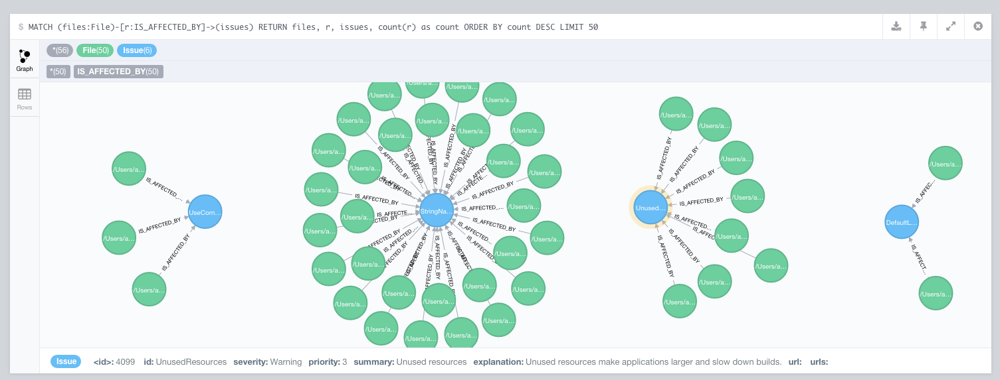

#lint-graph
A tool to emphasize relations between *Lint issues* and files.

**:construction: This tool is still under development :construction:**

##Motivation
[Android Lint](http://developer.android.com/tools/help/lint.html) is a powerful tool. It analyses all kinds of development artifacts and reports bad coding habits, conventions flaws and much more. It is nicely integrated into Android Studio and even features inline highlighting of violations, which is good for local development.

However, for large code bases or tons of legacy code one have to work with generated reports, which could be quite comprehensive and confusing.

So, this tool's objective is to organize the clutter by emphasizing the relations between *Lint issues* and files and providing an graphical representation of the Lint results.

##Utilizing the power of neo4j


Neo4j is the world's leading graph database. It features a mighty query language, [Cypher](http://neo4j.com/docs/stable/cypher-query-lang.html), as well as a [very convenient web interface](http://neo4j.com/developer/guide-neo4j-browser/).

Lint results are transformed into a graph and imported into a [neo4j graph database](http://neo4j.com/developer/graph-database/) using the principles explained below.

After the import (see usage section) the full power of Cypher could be used to discover relationships, for instance:
* Discover all files affected by a certain issue
* Discover all issues affecting a certain file
* Discover the file with the most issues
* ...

##Principles
The flat *Lint result list* is transformed into a graph. The graph schema consists of two different node types and three different relationship types:

* **Nodes**:

|Issue|File|
|---|---|
|An issue is reported by lint. It has an ID, a severity, an explanation and so forth.| A file within an analyzed Andoid application project which contains one or more issues.|
* **Relationships**:

|AFFECTS|IS_AFFECTED_BY|VIOLATES|
|---|---|---|
|This is a directional relationship from an issue node to a file node. It expressed that a certain issue affects a particular file.|This is a directional relationship from a file node to an issue node. It expresses that a certain file is affected by a particular issue.|This is a directional relationship from a file node to an issue node. It expresses that a certain file violates a particular issue. It holds several properties, such as line and column, where the violation is located or a message which explains the violation. |

##Setup
1. [Install neo4j server](http://neo4j.com/docs/stable/server-installation.html)
2. Start neo4j (on OSX & Linux: open a terminal, cd to the extracted folder, execute `bin/neo4j start`)
3. Open [http://localhost:7474](http://localhost:7474)


##Usage
1. Run `./gradlew lint` in your Android application project
2. Build *lint-graph* with `./gradlew build`
3. Run lint-graph

```shell
$ lint-graph <app_project>/build/outputs/lint-results.xml http://localhost:7474/db/data neo4j neo4j
```
